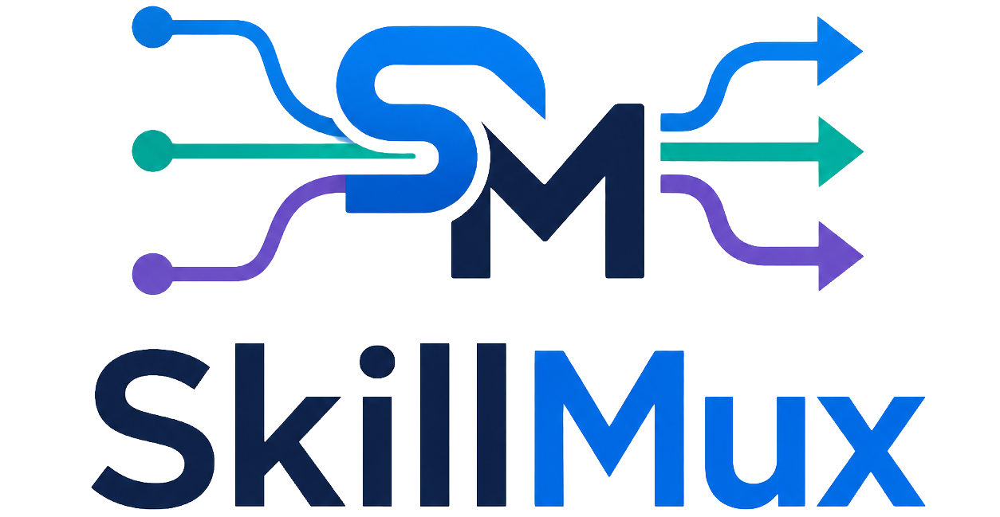

# skillmux

[中文文档 / Chinese Documentation](./README_CN.md)



**skillmux** is a high-performance CLI for managing Skills across multiple remote sources and multiple local runtime targets.

---

## Table of Contents
- [What is skillmux](#what-is-skillmux)
- [Core Capabilities](#core-capabilities)
- [Installation](#installation)
- [Command Overview](#command-overview)
- [Configuration](#configuration)
- [Source Resolution Rules](#source-resolution-rules)
- [Install Targets](#install-targets)
- [Examples](#examples)
- [Troubleshooting](#troubleshooting)
- [Development](#development)
- [License](#license)

---

## What is skillmux

Modern agent runtimes often need skills from different ecosystems (official registries, internal hubs, GitHub repos), and they may store those skills in different local folders.

`skillmux` solves this by providing:
- One unified CLI for **search / install / list / update / remove**.
- Multiple source backends in one tool.
- Multiple target layouts for different agent products.
- Reproducible metadata tracking for installed skills.

---

## Core Capabilities

### 1) Multi-source skill discovery
- Search skills from configured source providers.
- Built-in source adapters include:
  - `kingdee`
  - `clawhub`
- Rich search output includes:
  - slug
  - version
  - description

### 2) Flexible install flows
Install from:
- Named skill slug from configured source.
- GitHub shorthand:
  - `gh:owner/repo`
  - `github:owner/repo`
- Full GitHub repository URL.

Optional install controls:
- `--version` to pin a version when source supports versioning.
- `--ref` to install from a specific git ref.
- `--subdir` to install from a repository subdirectory.
- `--as` to rename the local installed folder.
- `--force` to overwrite/refresh existing content.
- `--json` for machine-readable output.

For registry sources, the local folder name defaults to the skill slug. Display names from `SKILL.md` are saved as metadata, which avoids duplicate installs when a skill has a localized display name.

### 3) Rich local inventory
`skillmux list` shows installed skills with metadata such as:
- target
- local skill name
- source
- version
- description

### 4) Safe updates
- Update one installed skill by name.
- Update all installed skills with `--all` or with no update argument.
- Shows per-skill `installed` / `updated` / `unchanged` status instead of repeated install logs.
- Keeps source information to make update behavior deterministic.

### 5) Clean removal
- Remove a skill from managed targets.
- Optional purge mode for deeper cleanup.

### 6) Multi-target support
Supports target-specific install layouts, including:
- `codex`
- `qoder`
- `qoderwork`
- `kiro`
- `workbuddy`

---

## Installation

### Via pip
```bash
pip install skillmux
```

### Verify installation
```bash
skillmux --version
```

---

## Command Overview

### Search
```bash
skillmux search <keyword> [--limit <n>] [--page <n>] [--json]
```

### Install
```bash
skillmux install <skill_or_repo>
  [--version <version>]
  [--ref <git-ref>]
  [--subdir <path>]
  [--as <name>]
  [-y|--yes]
  [--force]
  [--json]
```

### List
```bash
skillmux list [--json]
```

### Update
```bash
skillmux update [skill]
skillmux update --all [--ref <git-ref>]
```

### Remove
```bash
skillmux remove <skill> [--purge]
```

### Config
```bash
skillmux config list
skillmux config get <key>
skillmux config set <key> <value>
skillmux config targets <target1,target2,...>
skillmux config targets set <target1,target2,...>
skillmux config targets add <target1,target2,...>
skillmux config targets remove <target1,target2,...>
```

---

## Configuration

`skillmux` reads settings from config and command-line overrides.

Common configuration dimensions:
- API endpoint and timeout.
- Default source.
- Install targets.
- Token resolution strategy.

CLI-level override flags:
- `--config <path>`: use a specific config file.
- `--api <url>`: override API endpoint.
- `--token <token>`: provide token for the current run.
- `--source <name>`: override default source.

---

## Source Resolution Rules

When installing:
1. If input looks like GitHub shorthand/URL, it is handled by GitHub flow.
2. Otherwise it is resolved through the currently selected source backend.
3. Source metadata is persisted for future updates.

This design allows predictable updates even when multiple sources may contain similarly named skills.

---

## Install Targets

Each target maps to a specific local directory layout.

Why this matters:
- Different agent products discover skills in different paths.
- `skillmux` normalizes install/update/remove operations across these paths.

Recommended workflow:
1. Configure the target list once.
2. Install skills normally.
3. Use `list` and `update --all` for routine maintenance.

---

## Examples

### Basic flow
```bash
skillmux search pdf
skillmux install pdf-processing
skillmux list
skillmux update --all
skillmux remove pdf-processing
```

### Install from GitHub
```bash
skillmux install gh:owner/repo
skillmux install https://github.com/owner/repo
```

### Install from subdirectory at a ref
```bash
skillmux install gh:owner/repo --ref v1.2.3 --subdir skills/my-skill --as my-skill
```

### JSON output for automation
```bash
skillmux search retrieval --json
skillmux list --json
```

---

## Troubleshooting

### Skill not found
- Confirm source selection (`--source` or config default).
- Retry with a broader search keyword.

### Update fails for one skill
- Check whether the original source is still reachable.
- If source changed, remove and reinstall from desired source.

### Target mismatch
- Verify configured targets:
  ```bash
  skillmux config get install.targets
  ```

---

## Development

### Build
```bash
cargo build
```

### Format and check
```bash
cargo fmt
cargo check
```

### Release
The release helper keeps `Cargo.toml` and `pyproject.toml` in sync, commits the version bump, creates an annotated tag, pushes the branch and tag, then creates a GitHub release with generated notes.

Interactive:
```bash
python scripts/release.py
```

Non-interactive:
```bash
python scripts/release.py patch --yes
python scripts/release.py major --yes
```

PowerShell:
```powershell
.\scripts\release.cmd patch --yes
```

Use `--dry-run` to preview the release. The script requires a clean git worktree, `git`, and an authenticated GitHub CLI (`gh auth status`).

The `publish` GitHub Actions workflow runs when a GitHub Release is published. It builds PyPI wheels and standalone CLI archives for:
- `x86_64-unknown-linux-gnu`
- `aarch64-unknown-linux-gnu`
- `x86_64-pc-windows-msvc`
- `aarch64-pc-windows-msvc`
- `x86_64-apple-darwin`
- `aarch64-apple-darwin`

The workflow uploads all build outputs plus `SHA256SUMS.txt` to the same GitHub Release, publishes wheels to PyPI, and can update Homebrew, WinGet, and Launchpad PPA when the related secrets and variables are configured. See `packaging/homebrew`, `packaging/winget`, and `packaging/ppa` for the required CI configuration.

---

## License

Released under the terms of the repository license.
